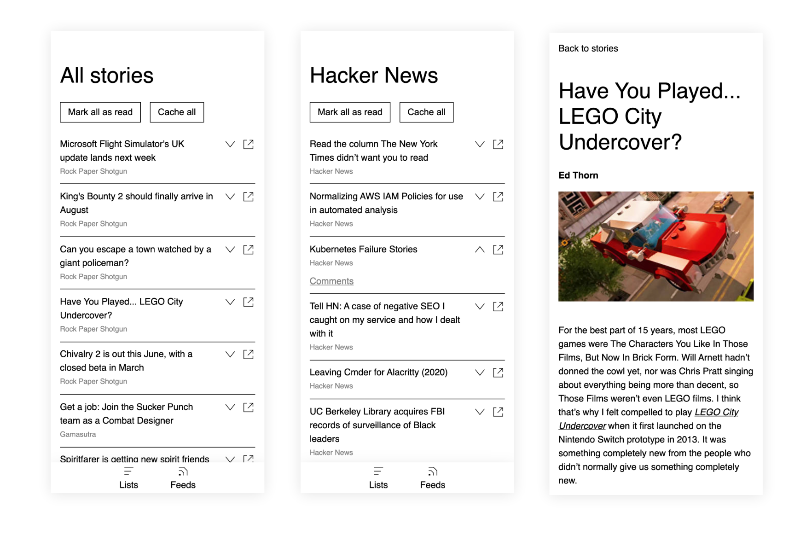

# Rasasa
A PWA to read RSS feeds, once the articles are cached the application can be used offline.

## Tech
- The [frontend](./client) is built with Typescript and React
- The [api server](./server) is built using Rust and [Actix Web](https://github.com/actix/actix-web)
- The [article cleanup server](./read-server) is writen in Node to leverage Mozilla's [Readability](https://github.com/mozilla/readability)
- The [gateway server](./gateway) is built using Go
- The [TUI](./rss) is built using Go and [Bubbletea](https://github.com/charmbracelet/bubbletea)

## WARNING
While the app is functional and I use it every day, this repo is mostly a playground to try out new patterns and tech. Error handling is basically non-existent and there are no tests. Here be dragons 🐉

## Running
The easy way to get the app up and running is to use the image hosted on
Github, you'll need a Postgres and a Redis database, run the following command
replacing the example values with the addresses of your databases:

```sh
docker run -it -p 8090:8090 \
--env "DATABASE_URL=postgres://tim@host.docker.internal/rasasa" \
--env "REDIS_URL=redis://host.docker.internal:6379" \
--env "RASASA_USER=username" \
--env "RASASA_PASS=alongpassword" \
ghcr.io/timdeve/rasasa/rasasa:latest
```

Otherwise you build it locally, in the repository root run:

```sh
docker build -t rasasa .
```

Then:

```sh
docker run -it -p 8090:8090 \
--env "DATABASE_URL=postgres://tim@host.docker.internal/rasasa" \
--env "REDIS_URL=redis://host.docker.internal:6379" \
--env "RASASA_USER=username" \
--env "RASASA_PASS=alongpassword" \
rasasa:latest
```

The app should be available at localhost:8090, use the `RASASA_USER` and `RASASA_PASS` values to login.
